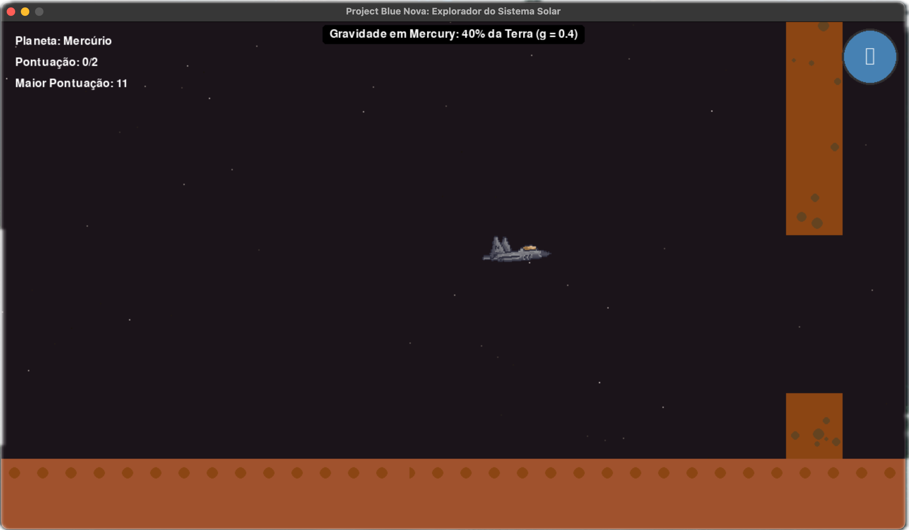
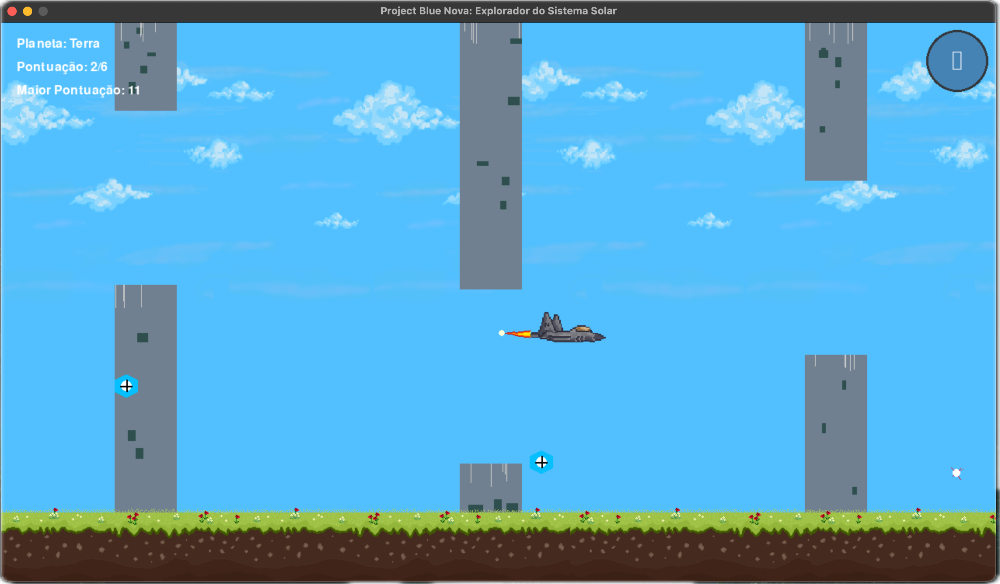

# Project Violetnova


## Navegue pelo Sistema Solar, Domine a Gravidade

Project Violetnova é um jogo educacional com tema espacial que ensina aos jogadores sobre astronomia, física espacial e diferenças gravitacionais entre corpos celestes em nosso sistema solar.



## Sobre o Projeto

Este é um jogo estilo arcade com conteúdo educacional que permite aos jogadores experimentar os diferentes ambientes gravitacionais do nosso Sistema Solar. De Mercúrio a Netuno, cada planeta foi recriado com precisão científica, permitindo uma experiência de aprendizado envolvente sobre astronomia e física espacial.



**Status de Desenvolvimento:** Pré-Produção

### Progresso

- ✅ Desenvolvimento de Conceito (100%)
- 🔄 Documento de Design do Jogo (70%)
- 🔄 Mecânicas Principais do Jogo (50%)
- 🔄 Programação (50%)
- 🔄 Design & Arte (20%)

## Características de Jogabilidade

### ⚙️ Adaptação à Gravidade

Os jogadores devem adaptar os controles de sua nave espacial à força gravitacional única de cada corpo celeste, exigindo diferentes estratégias para navegação.

### 💡 Quizzes Educacionais

Após completar cada nível, os jogadores devem responder a perguntas educacionais sobre o planeta que acabaram de explorar para continuar sua jornada.

### 🌌 Escala do Sistema Solar

Experimente a verdadeira escala e diferenças gravitacionais em nosso sistema solar:

| Planeta  | Gravidade relativa à Terra |
| -------- | -------------------------- |
| Terra    | 1.0x                       |
| Júpiter  | 2.4x                       |
| Saturno  | 1.1x                       |
| Netuno   | 1.1x                       |
| Vênus    | 0.9x                       |
| Urano    | 0.9x                       |
| Mercúrio | 0.4x                       |
| Marte    | 0.4x                       |
| Lua      | 0.16x                      |
| Plutão   | 0.06x                      |

### 🪨 Percurso de Obstáculos

Navegue por asteroides, detritos espaciais e tempestades solares exclusivas de cada ambiente planetário.

### 📊 Dados Coletáveis

Recolha módulos de dados científicos ao longo de cada nível para aprender mais sobre cada corpo celeste.

## Personagens do Jogo

### 🐱 Cadet Violet

Um gatinho curioso com aspirações de explorar todo o sistema solar. Sua curiosidade e agilidade naturais fazem deste felino o protagonista perfeito para esta jornada educacional.

### 🤖 NOVA-22

Assistente de IA inspirado no design do F-22 Raptor. NOVA-22 é seu companheiro durante toda a jornada, fornecendo fatos educacionais sobre cada corpo celeste e ajudando você a se adaptar a diferentes ambientes gravitacionais.

## Requisitos do Sistema

- Python 3.8+
- Pygame

## Instalação

```bash
# Clone o repositório
git clone https://github.com/seu-usuario/project_violetnova.git
cd project_violetnova

# Instale as dependências
pip install -r requirements.txt

# Execute o jogo
python main.py
```

## Controles

- **ESPAÇO** - Impulsionar nave
- **W** - Usar arma (quando disponível)
- **C** - Alternar modo de controle (toque/segurar)
- **A** - Ativar/desativar piloto automático (quando disponível)
- **ESC** - Sair do jogo

## Piloto Automático com Aprendizado de Máquina

Project Violetnova inclui um sistema de piloto automático baseado em Q-Learning, uma técnica de aprendizado por reforço que permite à nave aprender a jogar o jogo através de tentativa e erro.

### Características do Piloto Automático

- Aprende a controlar a nave adaptando-se à gravidade de cada planeta
- Responde automaticamente aos quizzes para progredir no jogo
- Reinicia automaticamente após perder vidas
- Melhora seu desempenho ao longo do tempo conforme mais partidas são jogadas

### Como usar o Piloto Automático

```bash
# Executar o jogo com piloto automático ativado
python main.py --autopilot

# Carregar um modelo de piloto automático previamente treinado
python main.py --autopilot --load-model modelo_salvo.npy

# Salvar o modelo treinado ao sair do jogo
python main.py --autopilot --save-model novo_modelo.npy
```

Durante o jogo, você pode alternar entre controle manual e piloto automático pressionando a tecla **A**.

## Planetas e Mecânicas

### Terra (Gravidade 1.0x)

Nosso planeta natal é a linha de base para a gravidade no jogo. A Terra tem um clima diversificado e é o nível tutorial inicial.

### Lua (Gravidade 0.16x)

Com apenas 16% da gravidade da Terra, a Lua oferece um forte contraste na jogabilidade, permitindo saltos mais altos e movimentos mais flutuantes.

### Júpiter (Gravidade 2.4x)

Com a gravidade mais forte de qualquer planeta em nosso jogo, Júpiter é um gigante gasoso com uma Grande Mancha Vermelha que é uma tempestade massiva maior que a Terra.

### Saturno (Gravidade 1.1x)

Famoso por seus belos anéis feitos de partículas de gelo e rocha, Saturno é um gigante gasoso com gravidade apenas ligeiramente maior que a da Terra.

*e muito mais...*

## Equipe de Desenvolvimento

Project Violetnova está sendo desenvolvido por uma equipe de estudantes da Universidade Presbiteriana Mackenzie, Faculdade de Computação e Informática.

- **Marcello Gonzatto Birkan** - Líder de Programação
- **Daniela Brazolin Flauto** - Líder de Design/Arte

## Licença

© 2025 Nebula Dream Interactive. Todos os direitos reservados.

**Project Violetnova** - Navegue pelo Sistema Solar, Domine a Gravidade.
